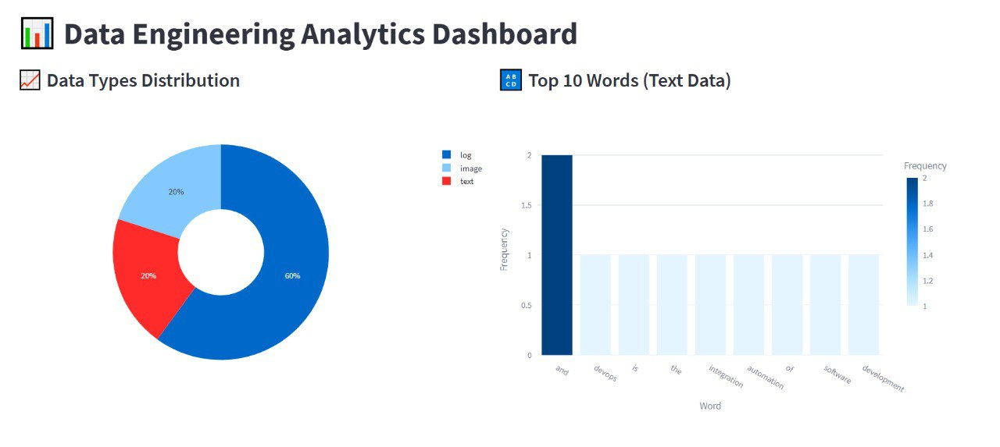

# Data Engineering ETL Pipeline & Analytics Dashboard

A fully containerized Data Engineering pipeline that extracts unstructured data (text, images, logs), transforms it using Python, and loads it into MinIO (Object Storage) and MongoDB (NoSQL). The project includes a Streamlit web application for data analytics and visualization.

---

### Dashboard Overview
Below is a snapshot of the Streamlit analytics interface, displaying the distribution of processed data types and the top 10 most frequent words extracted from our text sources.



## 2. Access the Web Interfaces
Once the containers are running, you can access the three main UI components. Below are the default local credentials (configurable via `.env`).

📊 **1. Analytics Dashboard (Streamlit)**
* **URL:** [http://localhost:8501]
* **Authentication:** None required.
* **What to look for:** View the distribution pie chart, explore the top 10 words, and search the unified metadata.

🍃 **2. MongoDB Database UI (Mongo Express)**
* **URL:** [http://localhost:8081]
* **Username:** `admin`
* **Password:** `pass`  
* **What to look for:** Click on the `metadata_db` database, then click on the `metadata` collection to view all the processed JSON documents.

🪣 **3. MinIO Object Storage Console**
* **URL:** [http://localhost:9001]
* **Username:** `admin`
* **Password:** `supersecretkey`
* **What to look for:** Click on "Object Browser" in the left menu to explore the files saved inside the `raw-data` and `processed-data` buckets.


## Architecture Schema

```mermaid
graph TD
    subgraph Extract
        A[Wikipedia API] --> E[Python Extractors]
        B[Unsplash API] --> E
        C[Synthetic Logs] --> E
    end

    subgraph Transform
        E -->|Raw Data| T[Transformers]
        T -->|Clean & Parse| U[Unified Metadata Schema]
    end

    subgraph Load
        E -.->|Save Raw| M1[(MinIO: raw-data)]
        U -->|Save JSON| DB[(MongoDB: metadata)]
        U -->|Save Processed| M2[(MinIO: processed-data)]
    end

    subgraph Analytics
        DB -->|Query| S[Streamlit Dashboard]
        M2 -->|Fetch Images| S
    end